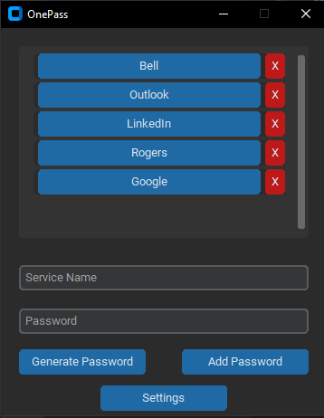

# OnePass

A simple password manager application built with Python and CustomTkinter.



## Description

This password manager allows users to securely store and manage their passwords. It uses AES encryption to encrypt the passwords before storing them in a file.

## Demo


## Installation

1. Clone the repository:

    ```bash
    git clone https://github.com/yourusername/password-manager.git
    ```

2. Install the required dependencies:

    ```bash
    pip install customtkinter pycryptodome pyperclip
    ```

## Usage

1. Run the application:

    ```bash
    python password_manager.py
    ```

2. When prompted, enter your master password to access the password manager.

3. Add passwords for different services using the "Add Password" button.

4. Passwords are copied to the clipboard when you click on the service name.

## Contributing

Contributions are welcome! Please create a pull request with your proposed changes.

## License

This project is licensed under the GNU General Public License - see the [LICENSE](LICENSE) file for details.
